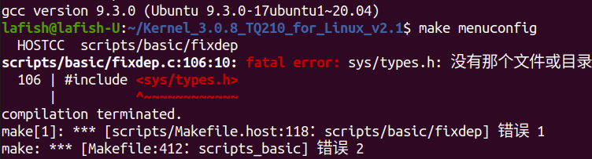
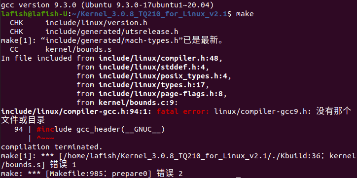
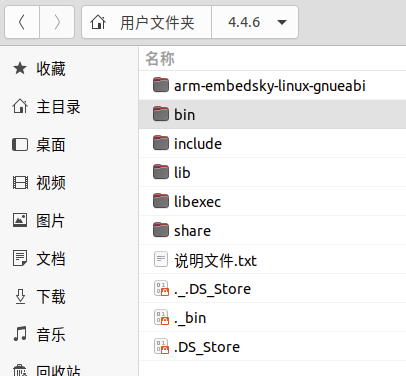
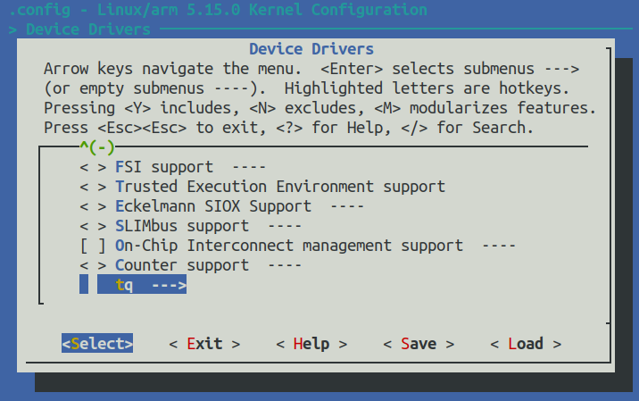
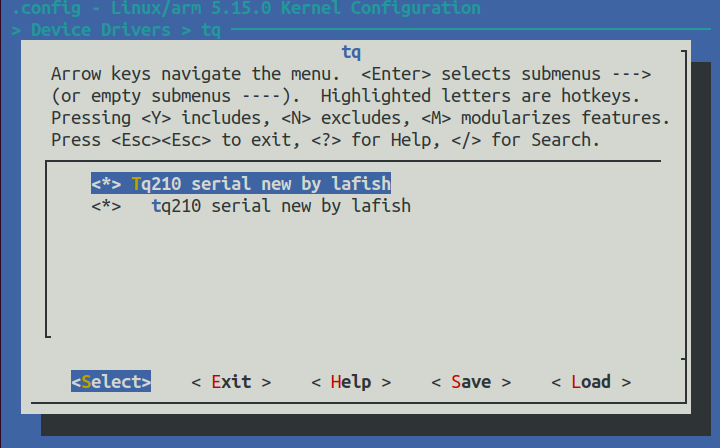
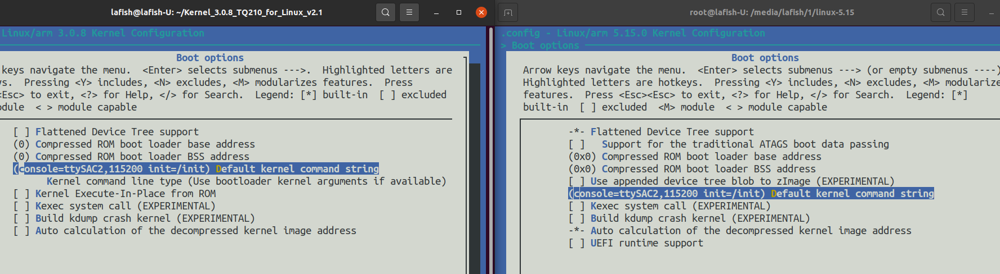

> 又啃了一星期网络垃圾，想走的已成末路，记录下

接 [Linux内核裁剪](https://lafish.fun/linux-kernel-clipping/)，当时用的是稍微新一点的 Linux 版本，内核是裁出来了，但测试根本启动不了。

结果这几天反复测试，应该是没有相关驱动的问题，但用天堑（这板子的开发商）提供源代码编译就没问题。这里给出”正常“流程。

# 正常流程

天堑提供的源代码是 3.0.8 的，之前安装的 arm-linux-guneabi-gcc 版本太新，所以不能编译旧的内核代码。下面出现的很多报错，都是编译工具太新导致的。





天堑友好地提供了 4.4.6 的编译工具源码，可以编译 3.0.8 的内核，只需要以下几步就能使用。

1. 代码准备：将 `天嵌官方资料/Linux平台工具/4.4.6_TQ210_release_20120720.tar.bz2` 解压到 `/home/lafish/` 



2. 添加环境变量：打开 `/home/lafish/.bashrc` 文件，最后加一行

   ```bash
   export PATH=/home/lafish/4.4.6/bin:$PATH
   ```

   

3. 使环境变量生效：终端输入

   ```bash
   source /home/lafish/.bashrc
   ```

   

4. 测试：开一个新终端，输入

   ```bash
   arm-linux-gcc -v
   ```

   正常情况会显示如果显示 `gcc version 4.4.6 (for TQ210 Embedsky Tech)` ，不正常会显示找不到文件和目录。

   不正常的原因是没有安装32位支持的库，可以用以下命令解决

   ```bash
   sudo apt install lib32z1
   ```

   很不凑巧，我的系统太新了，`lib32z1` 的依赖 `lib6-i386` 的依赖 `lib6`（你没看错，是依赖的依赖） 版本是最新的 2.32 ，而 `lib6-i386` 只能依赖 2.31 。很清晰了，得先解决依赖的依赖，才能安装依赖，才能安装 `lib32z1` ，输入下面的命令

   ```bash
   sudo apt reinstall libc6=2.31-@ubuntu9
   sudo apt install libc6-i386
   sudo apt install lib32z1
   ```

   

至此，环境准备的部分完成了，接下来的过程之前的一样，不同的地方在 Makefile 文件中的 `CROSS_COMPILE` 字段要赋值 `arm-linux-`，可能 `arm-embedsky-linux-gnueabi-` 也是可以的。

这一次导出的镜像测试就没问题了。

~~这就是“正常”流程，但很不正常好吧！为什么一定得用它魔改过的 Linux源代码？那 Ubuntu apt 拉取的 5.4 源代码又有什么意义？安装的 arm-linux-guneabi 又有什么用处？代码开源社区都找不到，”正常“流程根本接触不到开源社区，根本体验不到开源成果，捂得实实的，怪不得搞硬件这么赚钱。没有方向的试错就是浪费生命！有这几天我去整新项目不香吗？还有这中文互联网都充斥着什么垃圾，牛头不对马嘴的，广告满天飞，下载开源程序还要注册付费开会员？！~~

# 另外一些尝试

现在已经知道了是驱动缺失导致新内核不能启动，这里尝试将天堑代码里的驱动移植到新内核中，试试能不能在板子上跑新代码。找了一圈，网上的教程都是基于 3.0 内核的，只能自己琢磨了。

其他驱动可以先放放，串口驱动是一定要先有的，判断能否成功也是从串口读数据。

通过[TQ210内核驱动分布](http://blog.sina.com.cn/s/blog_bfd2dfb50102wf9d.html)这篇官方博客可以看到，串口驱动是 `drivers/serial/` 下的 `s5pv210.c` 、`samsung.c`两个文件。

在新内核代码 `driver/` 下创建一个新目录 `tq210serial` ，将 3.0.8 与 s5pv210、sunsung 相关的文件都丢进去。

新建 Makefile 和 Kconfig，填充内容：

```
# driver/tq210serial/Kconfig
menu "tq"
	config TQ210SERIAL
		tristate "Tq210 serial new by lafish"
		help
		  Tq210 serial driver

	config TQ210_SERIAL
		tristate "tq210 serial new by lafish"
		depends on TQ210SERIAL
		help
		  select it by y
endmenu

# driver/tq210serial/Makefile
obj-$(TQ210SERIAL)=s5pv210.o
obj-$(TQ210SERIAL)=samsung.o
```

在上层目录中的 Makefile 和 Kconfig 最后分别加上一行：

```
# driver/Kconfig
source "drivers/tq210serial/Kconfig"

# driver/Makefile
obj-$(CONFIG_TQ210SERIAL)		+= tq210serial/
```

这样就能在配置界面的 `Device Driver` 最后一项看到新选项了，全部勾选就能把驱动编译进内核。





额外还需要调整内核的启动参数



# 最后

遗憾，这次用手动打驱动编译出的内核还是启动不了。

可能因为驱动代码移植的是 3.0.8 版本的，当时的编译工具版本对于新代码来说太旧，编译出的 .o 文件不适用于新内核。

再往下走就要手动改写驱动代码，但这已经大大超出了我目前的技术水平，可能以后会学到，现在的我已经没精力去完善了。

到头来还是用回了旧版本，跟着人家的教程走。往好处想，我终于可以彻底放弃新内核的探索欲望，投入其他更有意思的项目中去。哈哈哈哈哈哈哈哈哈哈 (-_-) 


