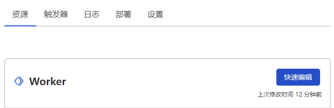

国内的主机绑定域名是需要备案的，不是域名备案，而是网站备案，流程比前者麻烦。通过域名访问没有备案的网站会被强制拦截。纯IP访问是允许的，但谁会记这玩意？
整了几个国内的便宜云主机，访问部署的服务还得先ping一下域名，再手打IP访问。这一天我受够了，想了些办法：

- 找个小本本
- 硬背
- 国外主机不需要备案
- 第三方短网址跳转

有钱就没这烦恼了，白嫖怪选第五个，用Cloudflare Workers自己搭短网址服务。

Cloudflare Workers的免费计划提供了每天10万次调用和每次10ms运行时间的serverless服务，对这个小需求足够了。更好的是，可以绑定域名！

在Cloudflare中创建一个Worker，在触发器中添加自定义域，绑定到域名就可以通过域名访问这个worker。


在资源标签页中点击快速编辑，将下面的代码CV上去。需要改的只有host和jump变量，优先匹配host内的字段。


```javascript
const host = {
    // doname.com/cf -> 1.1.1.1:80
    // doname.com/cf:123 -> 1.1.1.1:123
    // doname.com/cf/path -> 1.1.1.1/path
    // doname.com/cf?query=key -> 1.1.1.1?query=key
    'cf': '1.1.1.1',
}
const port = {
    // doname.com/cf:code -> 1.1.1.1:8443
    'code': 8443,
    'jenkins': 8081,
}
const jump = {
    // doname.com/bd -> http://baidu.com  
    'bd': 'http://baidu.com'
}

async function go(request) {
    const url = new URL(request.url);
    const {
        protocol,
        pathname,
        search
    } = url;
    let u = pathname.split('/')
    let t = u.splice(1, 1)
    let k = t[0].includes(':') ? t[0].split(':')[0] : t[0]
    let p = t[0].includes(':') ? t[0].split(':')[1] : '80'
    if (host.hasOwnProperty(k)) {
        const destinationURL = protocol + '//' + host[k] + ':' + (isNaN(p) ? port[p] : p) + u.join('/') + search;
        return Response.redirect(destinationURL, 301);
    } else if (jump.hasOwnProperty(k)) {
        return Response.redirect(jump[k], 301);
    } else {
        return new Response('can not 2 go, so u go die.', {
            headers: {
                'content-type': 'text/html;charset=UTF-8',
            },
        });
    }
}

addEventListener('fetch', event => {
    event.respondWith(go(event.request));
})
```

这样当我访问 `/cf:code/dir/file?data=123` 时，就能重定向到 `1.1.1.1:8443/dir/file?data=123`。果然还是自己的URL好记，配合上内网穿透，终于不会忘记乱七八糟的服务地址了！

