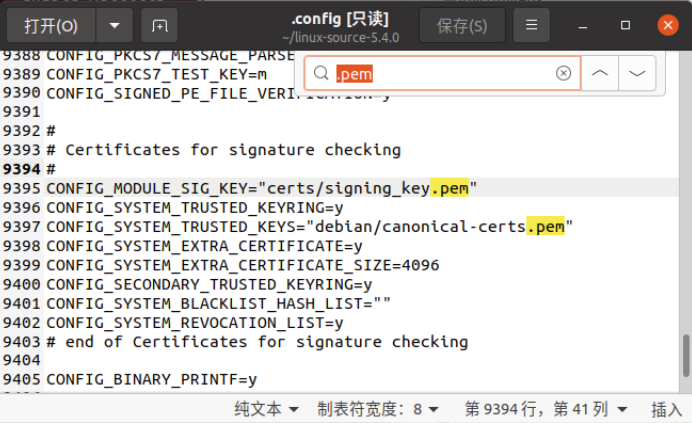
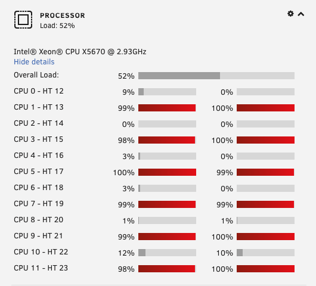
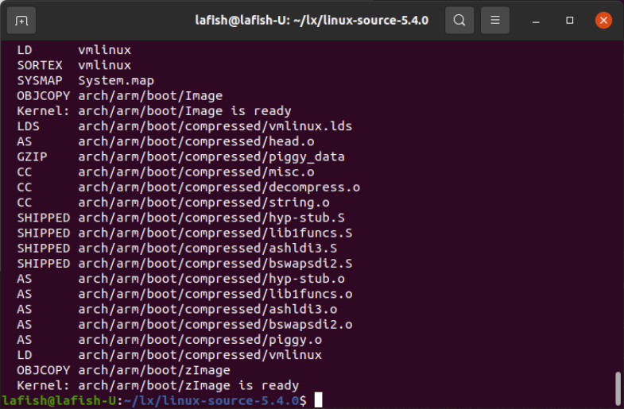
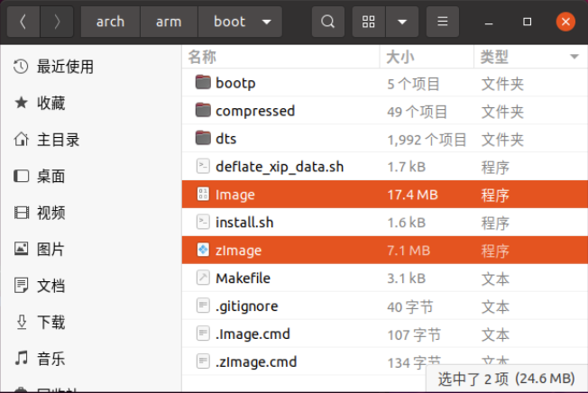

> 不知道最后能不能成功，但且先记录着，资料太多了，看得好迷茫。

安装虚拟机过程略，系统是`Ubuntu 20.04.3 LTS`。

# 环境准备

打开终端，下载 linux 源码，这里下载的版本是`5.4.0`

```bash
sudo apt-get install linux-source-5.4.0
```

下载完后打开下载目录，解压到 `/home/USERNAME` 。

值得一提的是这里的 `linux-source-5.4.0.tar.bz2` 是一个软链接，我们实际上是安装了一个软件包，这个软件包包含了源代码压缩包，并在 `/usr/src` 下创建了一个软链接，指向的是其同目录同名文件夹下的同名文件。

```bash
cd /usr/src #默认下载路径
tar -jxv -f linux-source-5.4.0.tar.bz2 -C /home/lafish #解压
```

进入解压后的源码目录

```bash
cd /home/lafish/linux-source-5.4.0
```

安装交叉编译器，这里的 gcc 版本是 `9.3.0`

```bash
sudo apt-get install gcc-arm-linux-gnueabi
arm-linux-gnueabi-gcc -v #查看版本
```

编辑源码根目录下的 `makefile` 文件，检索 `ARCH` 字段，等于号后面填的是目标平台，可以在 `arch/` 下找到对应的文件夹名。这里我们不填 `arm64` 而是 `arm`，前者会使后面的编译部分出现大量报错，原因未知。同时，在下一行增加 `CROSS_COMPILE`  填的是交叉编译的工具。

```makefile
#原
ARCH                    ?=

#改
ARCH                    ?= arm
CROSS_COMPILE   ?= arm-linux-gnueabi- #这一条本来没有，需要自己加上
```

此时输入 `make menuconfig` 启动配置内核界面会报错，根据提示安装缺少的软件包就行了，我就缺了4个包。

```bash
apt-get install ncurses-dev
apt-get install flex
apt-get install bison
apt-get install libssl-dev
```

# 内核裁剪

学艺不精，内核配置先略过，下篇再讲。这里从默认配置出发，先走一遍流程。

# 生成镜像（误）

配置完内核选项后，输入下面的命令生成镜像文件：

```bash
make zImage
```

出现报错：没有规则可制作目标“debian/canonical-certs.pem”

这是应该是证书出了问题，编辑源码根目录下的 `.config` 文件，检索 `.pem`，将两行代码中的值删除即可。



```
#原
CONFIG_MODULE_SIG_KEY="certs/signing_key.pem"
CONFIG_SYSTEM_TRUSTED_KEYRING=y
CONFIG_SYSTEM_TRUSTED_KEYS="debian/canonical-certs.pem"

#改
CONFIG_MODULE_SIG_KEY=""
CONFIG_SYSTEM_TRUSTED_KEYRING=y
CONFIG_SYSTEM_TRUSTED_KEYS=""
```

再次生成，再报错：can't open file "block/Kconfig"

看来是文件出了点问题，之前好奇动了很多东西，网上的笔记也看得很杂，改动也挺多的，下面重新解压代码重新搞。

# 生成镜像

有了之前的经历，例如源码下载、环境搭建等步骤就不用重新弄了。

重新将代码解压到合适位置，重新修改 `makefile` 与 `.config` 文件。再次运行生成指令：

```bash
make zImage
```

这次一切正常，但编译的速度有点慢了，可以加上 `-j` 参数开启多核编译。

```bash
make zImage -j12 #后面的数字代表CPU核心数
```

看这喂饱的CPU，针不戳。大概7分钟就生成好了，如果不加参数可能是12倍之多了。





生成镜像的路径在 `arch/arm/boot/`，路径与文件都与师兄师姐们的笔记不一样，应该是代码版本不同导致的，`zimage` 是 `image` 压缩后的文件，即便按照默认配置生成，这也是小到出乎我意料。




# 总结与问题

从[linux官方文档库](https://www.kernel.org/doc/html/)中可以看到，最新linux源代码版本是5.15，apt获取的源码而是19年的版本，如果需要从新的源码编译，就得手动下载。之前一条条 `apt-get install` 安装的工具也一样，很可能是过时的，如果需要安装新的软件，就需要自行去官网下载已编译或甚至编译的软件源码自行安装。这个过程是可以预见的，希望后面的记录会有体验到。

试过几次裁剪都以失败告终，例如中间提到的文件问题。但默认配置生成的镜像大小至少让我明白了，现阶段裁剪更多的是无用的驱动程序，在编译过程中出现了很多其他品牌的驱动都是无用的。

最后，提出一些问题，希望后面的篇章能做出解答：

- Uboot相关制作的切入点
- 根目录系统制作与Busybox的关系
- arch=arm64不可用的原因
- make menuconfig的大致流程
- 启动裁剪系统的方法

