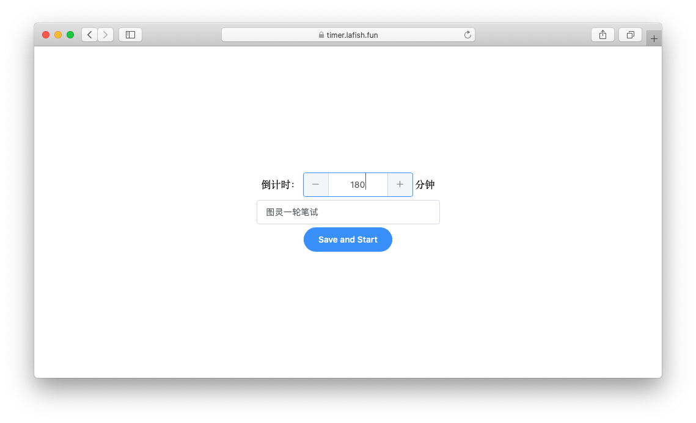
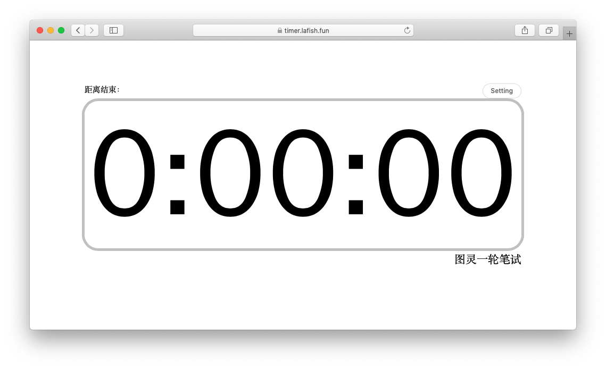
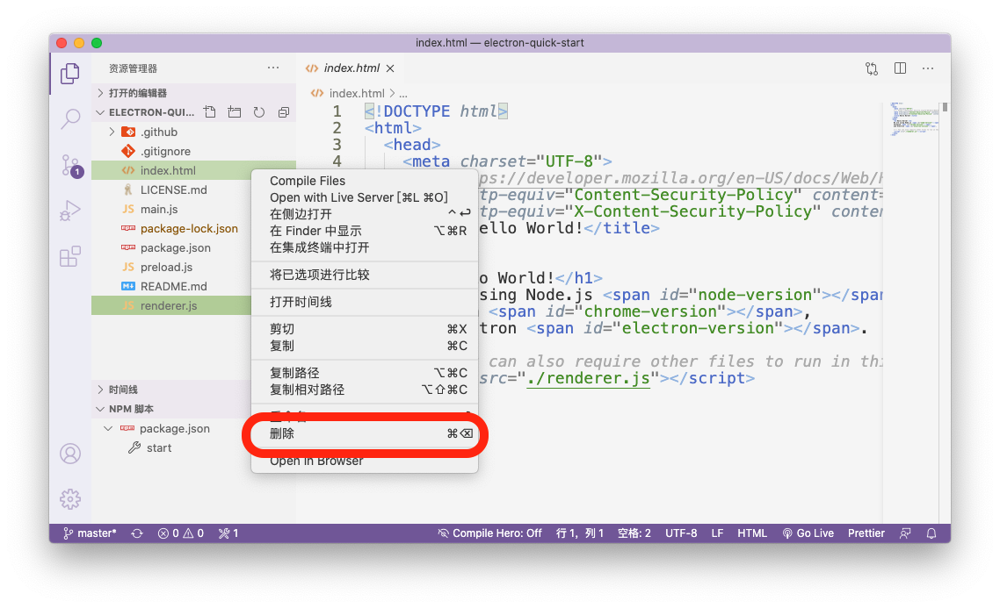
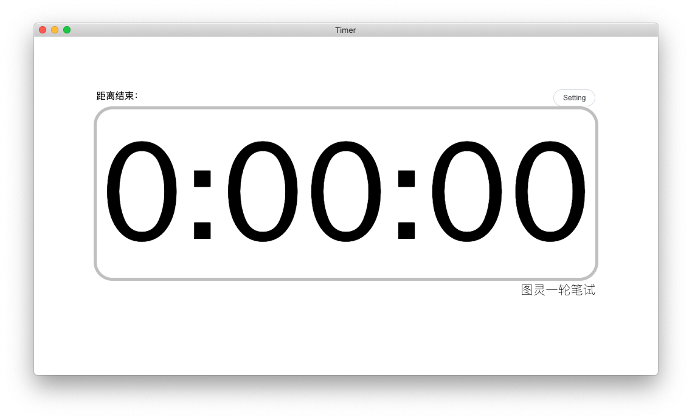
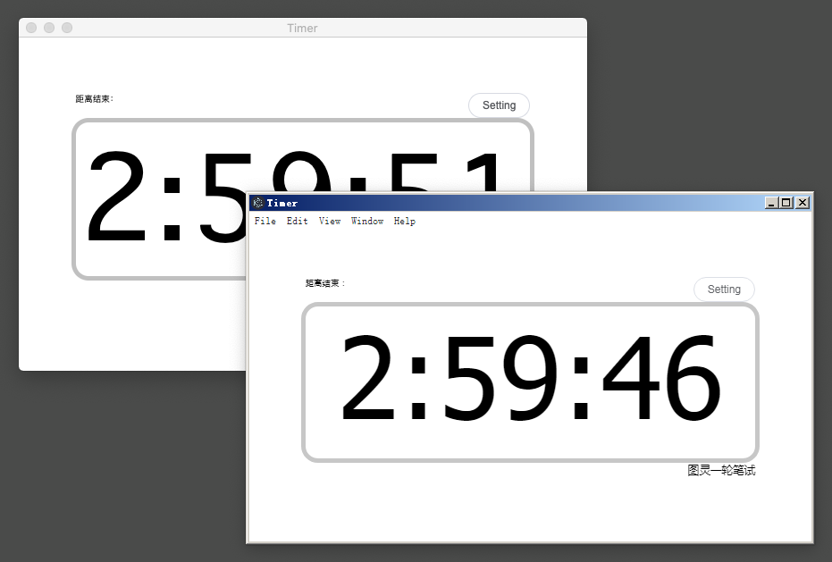
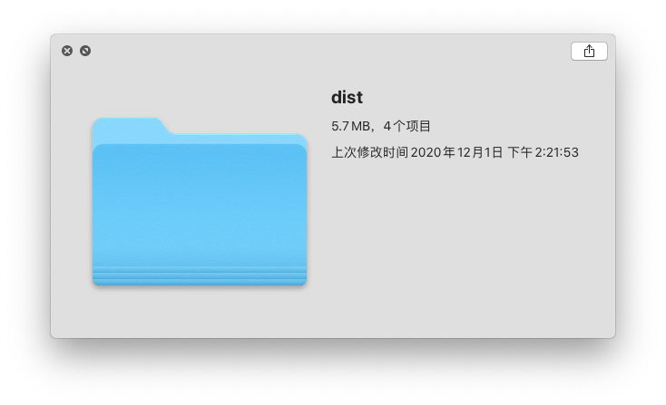
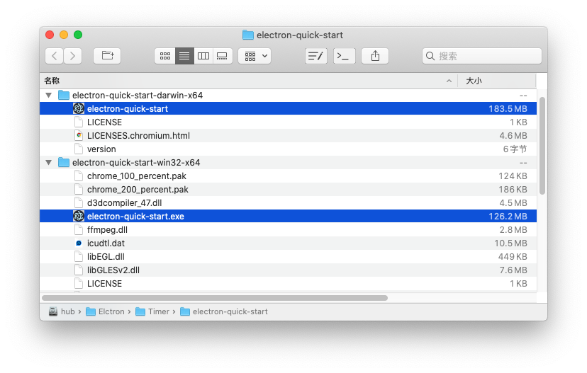

# 写在前面

这里是写作文苦手，退堂鼓大师，未来秃头码农，图灵新一届的前端小白。翻了翻公众号往期推文，发现前端的师兄师姐们各个身怀绝技，把我肚子里有的写了个遍。这篇推文就给大家介绍一个前端领域很火的小玩具——Electron。

在近期的图灵招新一轮笔试中，大家想在讲台投影剩余考试时间，这使我催生出用前端做出桌面应用的想法。

> 如果你可以建一个网站，你就可以建一个桌面应用程序。 Electron 是一个使用 JavaScript, HTML 和 CSS 等 Web 技术创建原生程序的框架，它负责比较难搞的部分，你只需把精力放在你的应用的核心上即可。--官网

可以说，Electron几乎是前端开发桌面应用的唯一途径，很多大厂都使用 Electron 开发自己的原生应用，微软的Visual Studio Code就是Electron的成功开发案例。

下面我就从一个倒计时网页入手，借助Electron制作适用于macOS和Windows系统的桌面软件。

# 网页准备

使用Vue框架开发倒计时网页的部分就不献丑了，直接贴build出的代码。

```
https://github.com/LeUKi/Timer    
```





[演示地址]: http://timer.lafish.fun/

# 安装

Electron官方友好地提供了一个测试demo，在此基础上稍作调整，就可以很轻松地完成转换。

```bash
git clone https://github.com/electron/electron-quick-start
cd electron-quick-start
npm install
```

在demo项目安装包文件的最后会一并安装Electron，如果下载速度很慢可以提前结束进程，使用```cnpm install electron -g ```加速安装Electron。

安装完后可以输入```electron .```测试，如果能弹出demo应用窗口，则代表安装完成。

# 调整文件

我们需要把官方demo的网页演示文件，替换为我们自己的网页。

删除electron-quick-start文件夹内的```index.html```和```renderer. js```，将之前用Vue写好并build出的页面放进去。



再次输入```electron .```测试，如果能弹出倒计时应用窗口，则代表替换成功了。



# 打包应用

上述过程的electron相当于一个另类的浏览器，它能让网页脱离系统浏览器，运行在各种系统上。我们希望分发给用户的东西是个完整体，即开即用，无需编译，所以我们还需要打包应用。

electron-packager是Electron开发常用的打包工具，它可以将Electron项目打包为macOS、Windows和Linux上的可执行文件或者安装文件。

```bash
cnpm install electron-packager -g
```

安装完后在项目根目录输入```electron-packager . --platform=win32```即可完成Windows应用的打包，针对macOS平台把```win32```改为```darwin```即可。

在electron-quick-start-darwin-x64和electron-quick-start-win32-x64文件夹中，我们可以找到对应的程序文件，运行效果和使用```electron .```测试无异。!



# 写在最后

很可笑的是，就这么一个简单的网页应用，打包完后两个平台的程序体积都能达到百来兆，而原本的网页文件仅有5.7M。~~把网页和浏览器安装包放在一起都没这么大 XD~~





总的来说，对于初入前端的老菜鸟，Electron有很大的吸引力，前端可以不用写